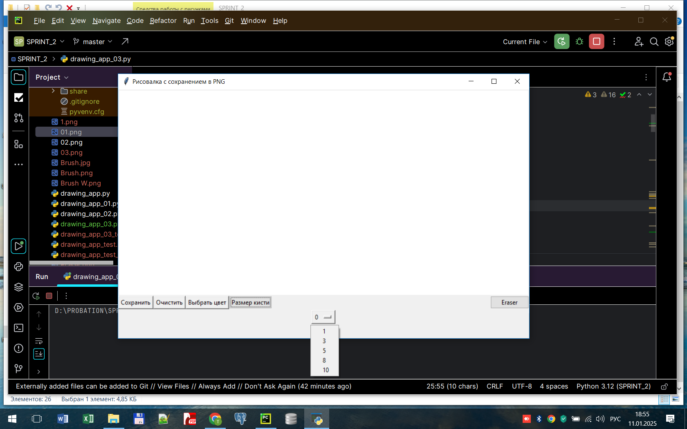
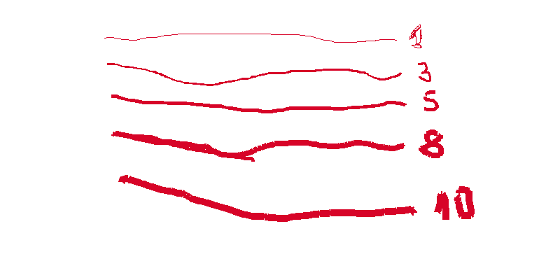
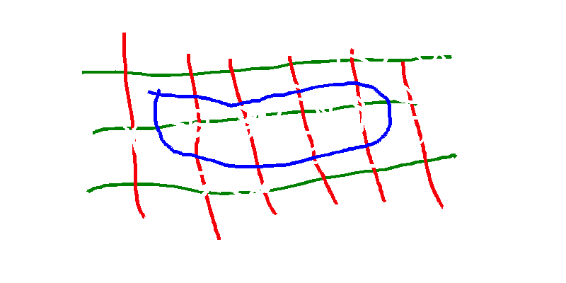
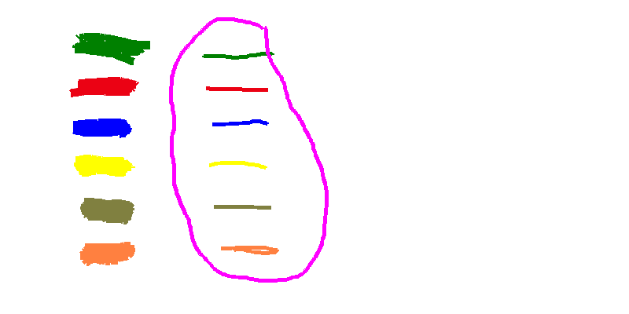

## "Программа для создания изображений на основе TKinter"

#### Данная программа представляет собой пример использования библиотеки TKinter для создания графического интерфейса.

**Класс DrawingApp**

Инициализация __init__(self, root)

Конструктор класса принимает один параметр:

- root: Это корневой виджет Tkinter, который служит контейнером для всего интерфейса приложения.

Внутри конструктора выполняются следующие ключевые действия:

- Устанавливается заголовок окна приложения.

- Создается объект изображения (self.image) с использованием библиотеки Pillow. Это изображение служит виртуальным холстом, на котором происходит рисование. Изначально оно заполнено белым цветом.

- Инициализируется объект ImageDraw.Draw(self.image), который позволяет рисовать на объекте изображения. 

- Создается виджет Canvas Tkinter, который отображает графический интерфейс для рисования. Размеры холста установлены в 600x400 пикселей.

- Вызывается метод self.setup_ui(), который настраивает элементы управления интерфейса.

- Привязываются обработчики событий к холсту для отслеживания движений мыши при рисовании () и сброса состояния кисти при отпускании кнопки мыши ().

- Устанавливается начальный размер кисти = 1.
- Привязывается правая кнопка мыши к методу выборки цвета пикселя холста.
- Привязывается "Горячие клавиши" клавиатуры к методам выбора цвета кисти и сохранения изображения в файле.

**Метод setup_ui(self)**

Этот метод отвечает за создание и расположение виджетов управления:

- Кнопки "Очистить", "Выбрать цвет", "Сохранить" и "Выбрать размер кисти" позволяют пользователю очищать холст, выбирать цвет кисти, сохранять текущее изображение, и выбирать размер кисти (толщину линии) соответственно.
Выпадающий список  содержит значения толщины линии кисти в пикселях.

**Метод paint(self, event)**

Функция вызывается при движении мыши с нажатой левой кнопкой по холсту. Она рисует линии на холсте Tkinter и параллельно на объекте Image из Pillow:

- event: Событие содержит координаты мыши, которые используются для рисования.

- Линии рисуются между текущей и последней зафиксированной позициями курсора, что создает непрерывное изображение.

**Метод reset(self, event)**

Сбрасывает последние координаты кисти. Это необходимо для корректного начала новой линии после того, как пользователь отпустил кнопку мыши и снова начал рисовать.

**Метод clear_canvas(self)**

Очищает холст, удаляя все нарисованное, и пересоздает объекты Image и ImageDraw  для нового изображения.

**Метод choose_color(self)**

Открывает стандартное диалоговое окно выбора цвета и устанавливает выбранный цвет для кисти как текущий.

**Метод save_image(self)**

Позволяет пользователю сохранить изображение, используя стандартное диалоговое окно для сохранения файла. Поддерживает только формат PNG. В случае успешного сохранения выводится сообщение об успешном сохранении.

**Метод drop_down_menu(self)**

- создает выпадающее окно со значениями размера кисти в пикселях. 
Выбор значения из списка и установка параметров кисти
  завершается нажатием кнопки Enter

**Метод show(self)**

- присваивает кисти выбранный размер и убирает выпадающее окно с экрана
  после  выбора  размера  кисти
- выбранный  размер  кисти  печатается в окне терминала.

**Метод hide_button(self, btn_name)**

- функция убирает изображение кнопки "btn_name" с экрана

**Метод eraser(self)**
- Функция активирует Eraser (Ластик) с толщиной
выбранного  размера  кисти. Для продолжения
рисования  необходимо выбрать цвет линии.

**Метод pick_color(self,event)**
- Функция получает цвет выбранного пикселя холста
и устанавливает его в качестве активного цвета кисти.
Активация функции осуществляется правой кнопкой мыши в выбранной точке холста.
- - RIGHT(выбор пикселя) 
- - RIGHT(получение цвета)
- - LEFT(сброс координат для последующего  рисования).

**Метод get_rgb(self, rgb)**
-  Функция преобразует формат цвета из RGB в HEX.

***Обработка событий***

- : Событие привязанное к методу "paint", позволяя рисовать на холсте при перемещении мыши с нажатой левой кнопкой.

- : Событие привязанное к методу "reset", сбрасывает состояние рисования для начала новой линии.

- : Событие привязанное к методу "pick_color"

***Использование приложения***

**Пользователь может:** 
- рисовать на холсте, 
- выбирать цвет и размер кисти
- корректировать изображение ластиком
- получать цвет уже нарисованных фигур и
  загружать его в кисть для продолжения рисования
- очищать холст 
- сохранять изображение в формате PNG.

### Примеры работы программы:
**- общий вид холста с кнопками управления**
 
**- выбор толщины линии**
  
**- работа ластика**
  
**- загрузка цвета нарисованных фигур(пипетка)**
  
